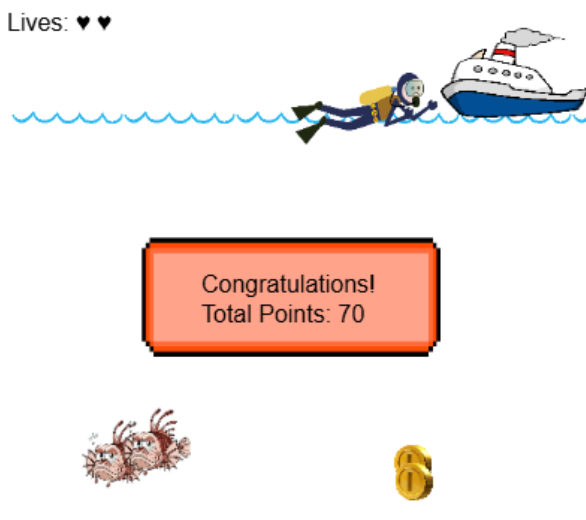

# 🌊 Beneath the Waves: Treasure Hunt 🏴‍☠️

An underwater adventure game built with Python




*Navigate your diver through dangerous waters to collect treasure and return safely to the boat!*

## 📖 Game Description

You're a treasure hunter looking for buried coins beneath the ocean waves! Use your diving skills to collect golden treasures while avoiding dangerous lionfish that patrol the waters. Once you've gathered your loot, make your way back to the rescue boat before time runs out!

### Key Features
- ⚡ **Real-time Action** - Fast-paced underwater adventure
- 🐠 **Dynamic Enemies** - Avoid moving lionfish threats
- 🪙 **Treasure Collection** - Collect coins to increase your score
- ❤️ **Lives System** - Multiple chances to complete your mission

## 🎯 How to Play

### 🎮 Controls
- `↑` Move Up
- `↓` Move Down  
- `←` Move Left
- `→` Move Right

### 🏆 Objectives
1. **Collect Coins:** Navigate through the water to collect golden treasure coins (+10 points each)
2. **Avoid Lionfish:** Dangerous lionfish swim through the waters - touching them costs you a life!
3. **Manage Your Lives:** You start with 5 lives (hearts). Don't let them all run out!
4. **Escape to Safety:** After 15 seconds, a rescue boat appears. Reach it to win the game!
5. **Maximize Your Score:** Collect as many coins as possible before escaping

### 🎲 Game Elements
- **🤿 Diver:** Your character - keep them safe!
- **🪙 Gold Coins:** Treasure to collect for points
- **🐠 Lionfish:** Dangerous enemies that cost you lives
- **🚤 Rescue Boat:** Your escape route after 15 seconds
- **🌊 Ocean Environment:** Beautiful underwater setting

## 🚀 Installation & Setup

### 📋 Requirements
- Python 3.11 or higher
- PIL (Python Imaging Library)
- tkinter (usually included with Python)

### 💻 Installation Steps

1. **Clone the repository:**
   ```bash
   git clone https://github.com/TiffusionLabs/Beneath-the-Waves_-Treasure-Hunt.git
   cd beneath-the-waves-treasure-hunt
   ```

2. **Install required dependencies:**
   ```bash
   pip install Pillow
   ```

3. **Run the game:**
   ```bash
   python main.py
   ```

### 📁 File Structure
```
beneath-the-waves-treasure-hunt/
├── main.py              # Main game file
├── graphics.py          # Custom graphics library
├── images/              # Game assets
│   ├── diver2.png      # Player character
│   ├── fish.png        # Enemy lionfish
│   ├── boat.png        # Rescue boat
│   ├── coin.png        # Treasure coins
│   ├── waterline.png   # Water effects
│   └── GameOver.png    # Game over screen
└── README.md           # This file
```

## 🏅 Game Features

- **Smooth Animation:** Fluid movement and object animations
- **Collision Detection:** Precise collision system for interactions
- **Dynamic Difficulty:** Enemies move at varying speeds
- **Visual Effects:** Flash effects when collecting items or taking damage
- **Score System:** Track your treasure hunting progress
- **Lives Display:** Visual heart-based life counter
- **Time-based Progression:** Rescue boat appears after survival period
- **Responsive Controls:** Smooth keyboard input handling

## 🎮 Gameplay Tips

- **Stay Mobile:** Keep moving to avoid the patrolling lionfish
- **Plan Your Route:** Look ahead to plan safe paths to coins
- **Time Management:** Balance coin collection with survival
- **Use the Boundaries:** The edges of the screen can provide safe zones
- **Watch the Timer:** Remember the boat appears after 15 seconds
- **Risk vs Reward:** Sometimes it's better to escape than risk your last life for more coins

## 🤝 Contributing

Contributions are welcome! Feel free to:

- Report bugs or issues
- Suggest new features or improvements
- Submit pull requests
- Create additional game levels or assets

## 👨‍💻 Author

Created with ❤️ by TiffusionLabs

Feel free to reach out for questions or feedback!

---

*Happy treasure hunting! 🏴‍☠️⚓*
